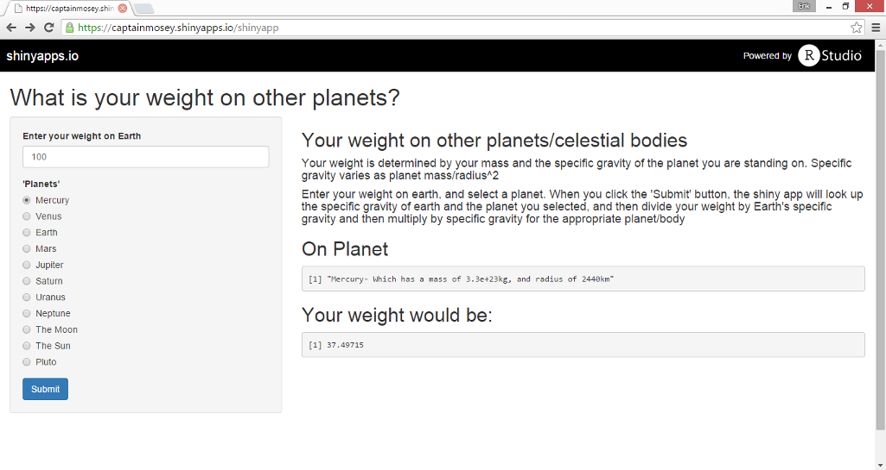
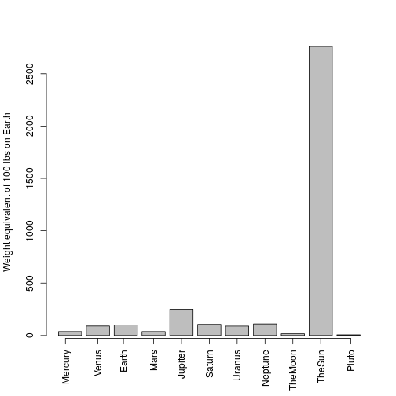

## Have you ever wondered...

- ... How much you would weigh on other planets (and the sun!)
- ... How you would calculate your weight
- ... Why there isn't a free shiny app that can calculate that for you

--- .class #id 

## Wonder No More!

Finally, a free, easy to use Shiny app that will calculate your weight on every planet in our solar system!

--- .class #id 

## Easy to use!
- You just need a scale and a computer with a keyboard
- Enter your weight on Earth, and choose a planet
- The app takes care of all the math for you:

 $Your New Weight= {Your Weight On Earth}*\frac{New Planet's Mass}{New Planet's Radius^2}/\frac{Earth's Mass}{Earth's Radius^2}$

--- .class #id 

## Always know your weight!

As shown below, the weight of a 100lb person can vary wildly from planet to planet. Bookmark <a href="http://captainmosey.shinyapps.io/shinyapp"> Your Weight on other Planets</a> and always know your weight!

 
